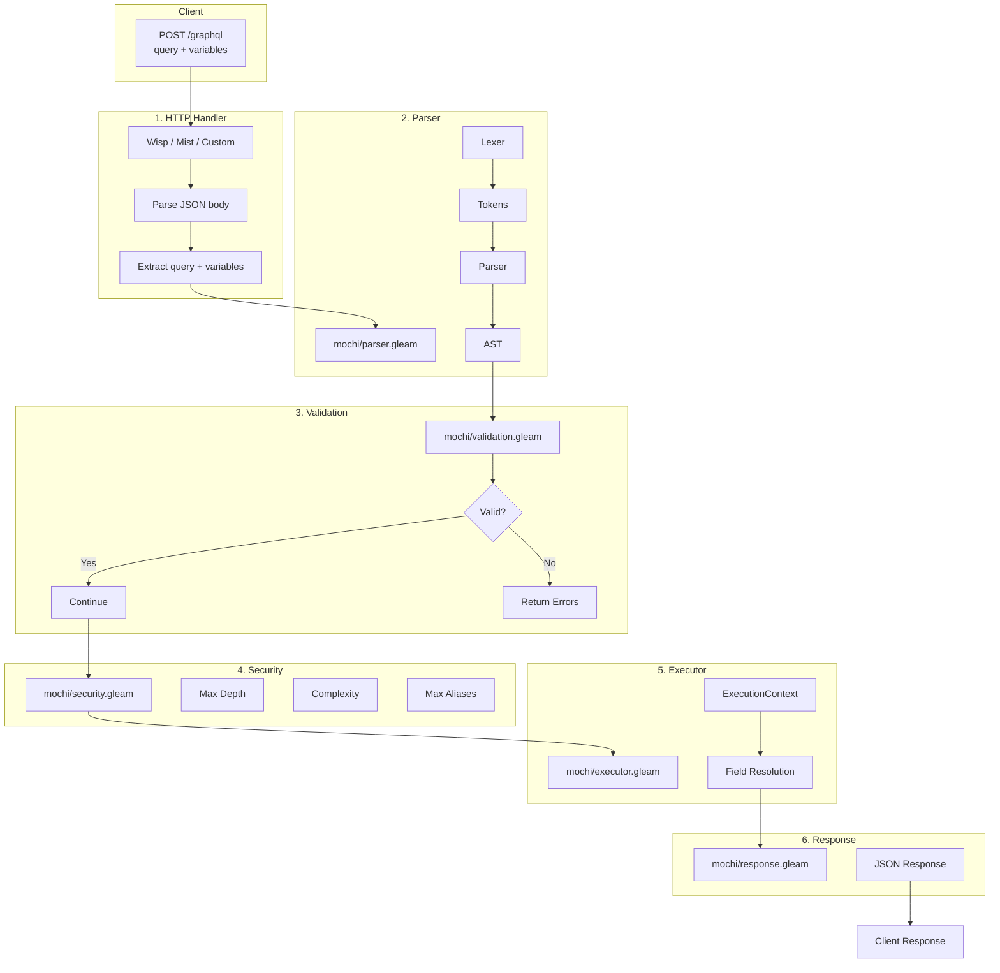
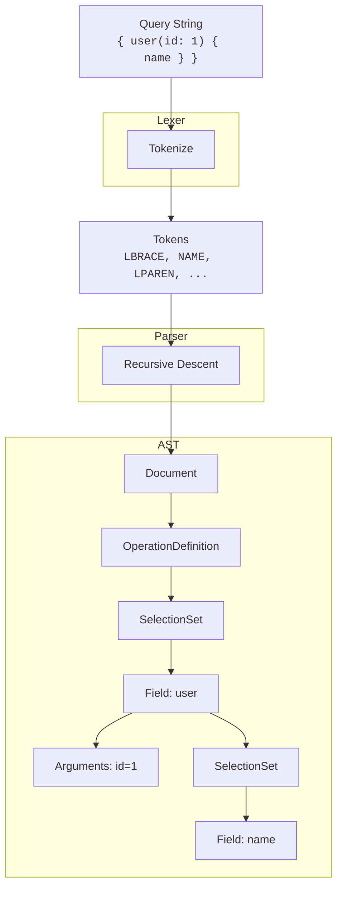
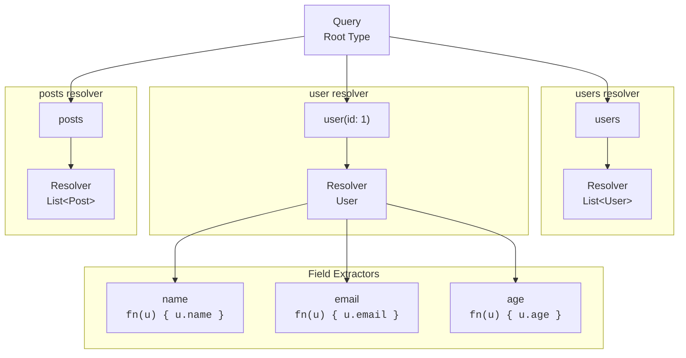
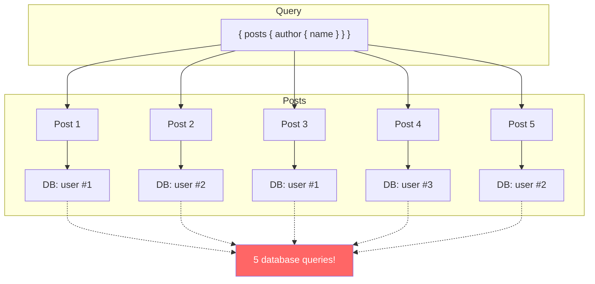
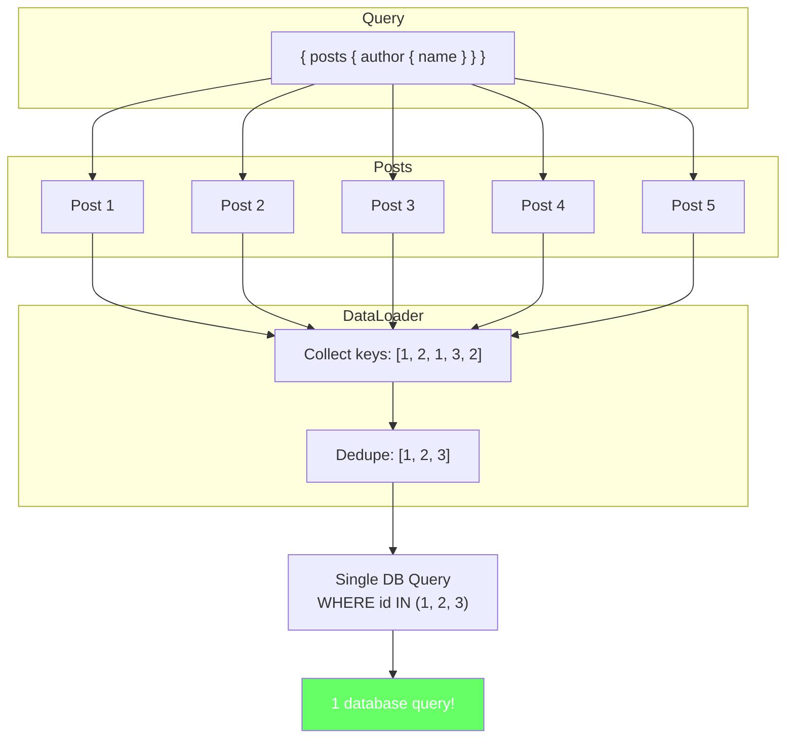
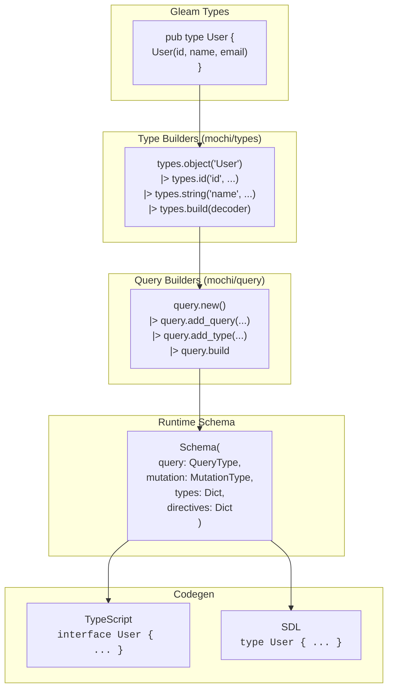
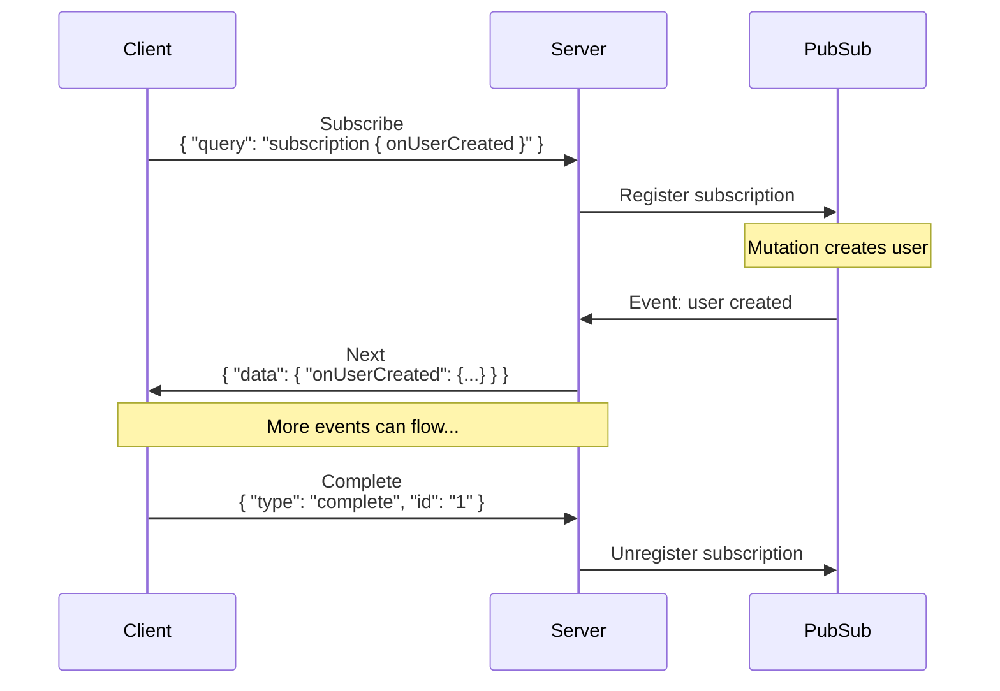
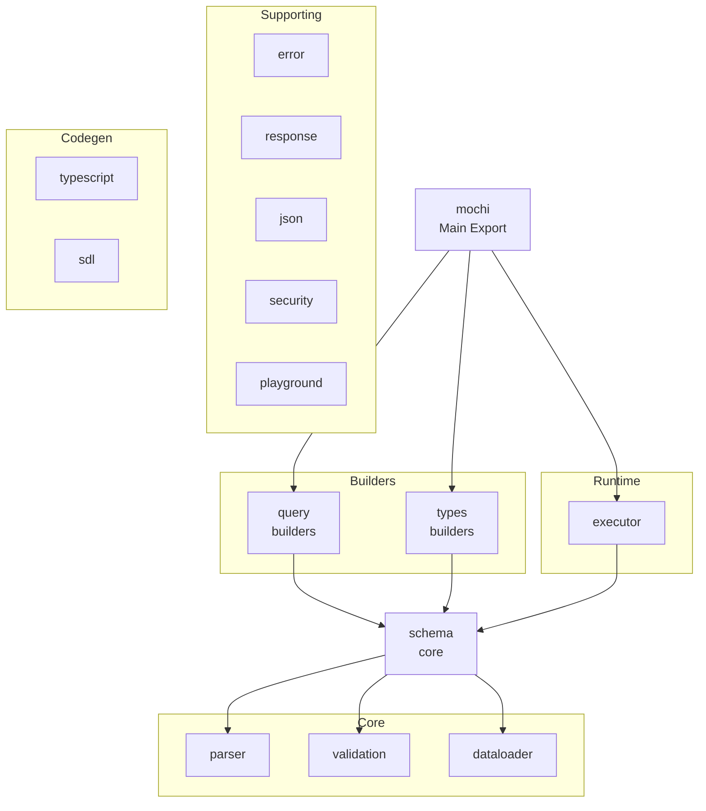
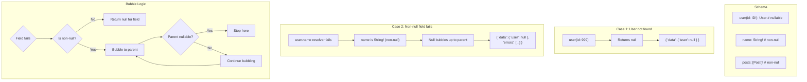

# Mochi Architecture

This document describes how Mochi processes GraphQL requests from receiving a query to returning a response.

## High-Level Flow



## Parser Pipeline



## Executor Field Resolution



## DataLoader Batching

### Without DataLoader (N+1 Problem)



### With DataLoader



## Schema Definition Flow



## Subscription Flow



## Module Dependencies



## Null Propagation



## File Structure

```
src/mochi/
├── query.gleam                 # Query/Mutation/Subscription builders
├── types.gleam                 # Type builders (object, enum, fields)
├── schema.gleam                # Core schema types, ExecutionContext
├── parser.gleam                # GraphQL query parser
├── executor.gleam              # Query execution engine
├── validation.gleam            # Query validation
├── dataloader.gleam            # N+1 query prevention
├── subscription.gleam          # PubSub subscription system
├── subscription_executor.gleam
├── error.gleam                 # GraphQL-spec errors
├── response.gleam              # Response serialization
├── json.gleam                  # JSON encoding
├── security.gleam              # Query security
├── persisted_queries.gleam     # APQ support
├── playground.gleam            # GraphQL IDEs
├── codegen/
│   ├── typescript.gleam        # TypeScript codegen
│   └── sdl.gleam               # SDL codegen
└── transport/
    └── websocket.gleam         # WebSocket transport
```
