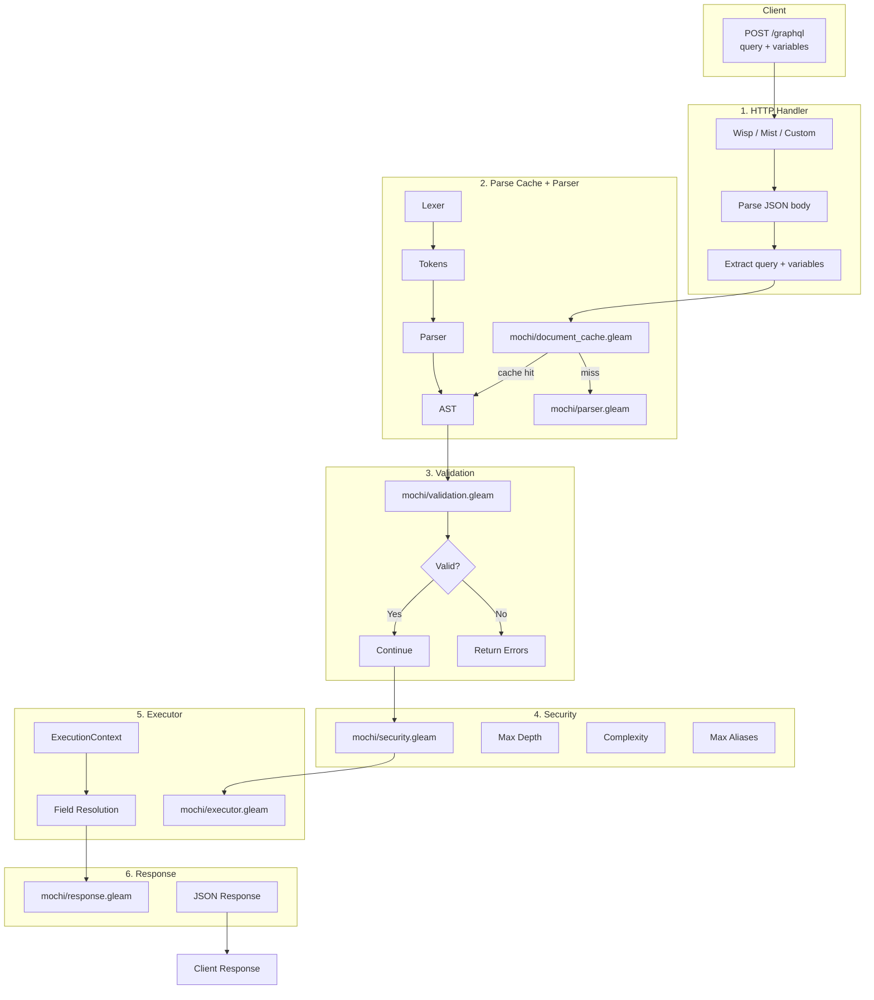
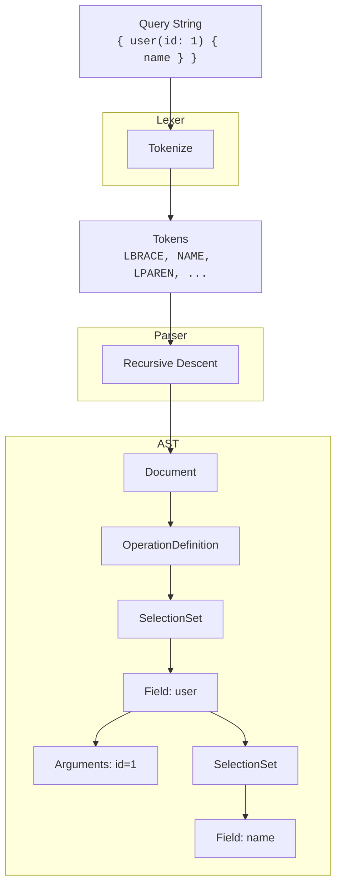
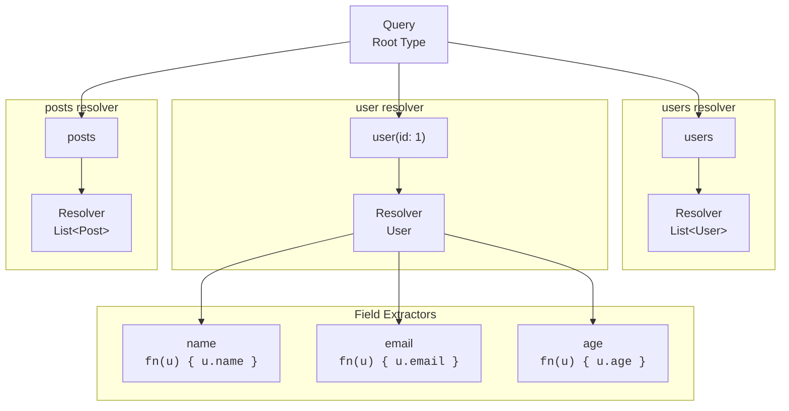
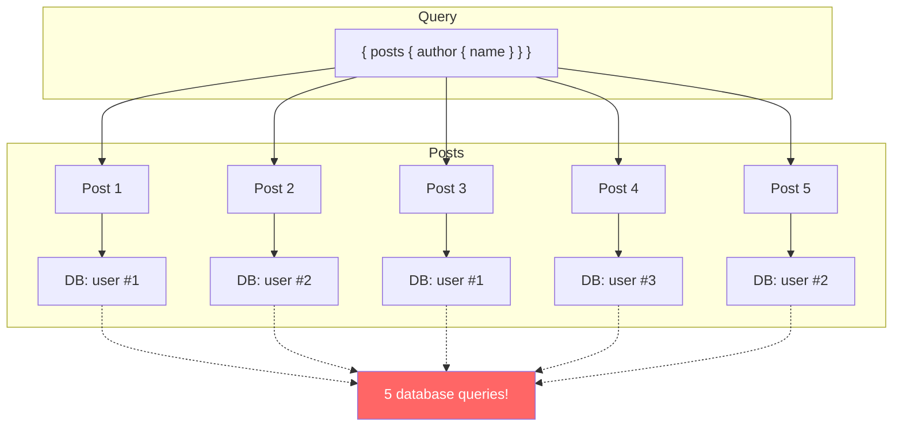
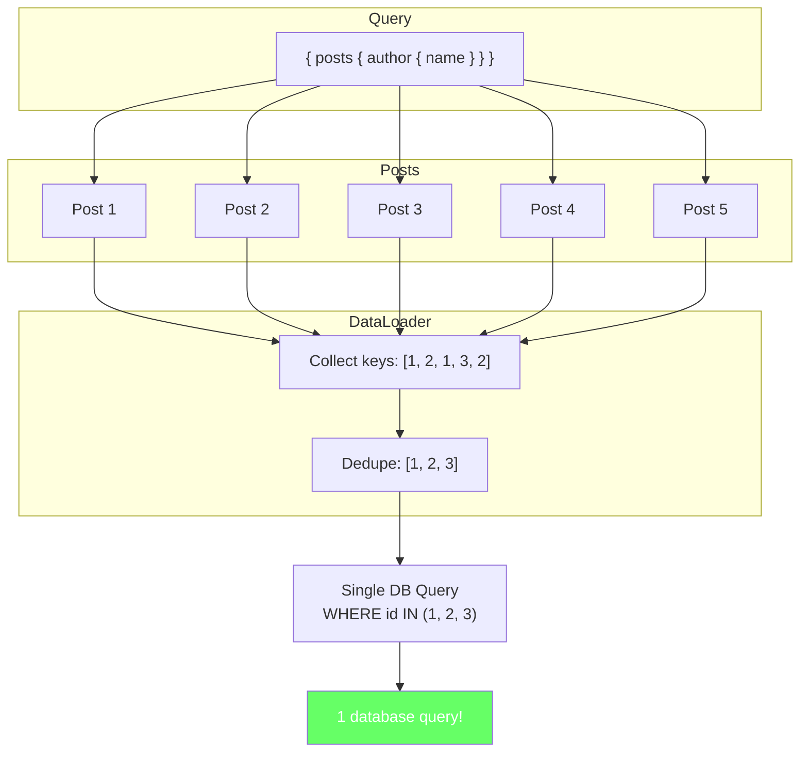
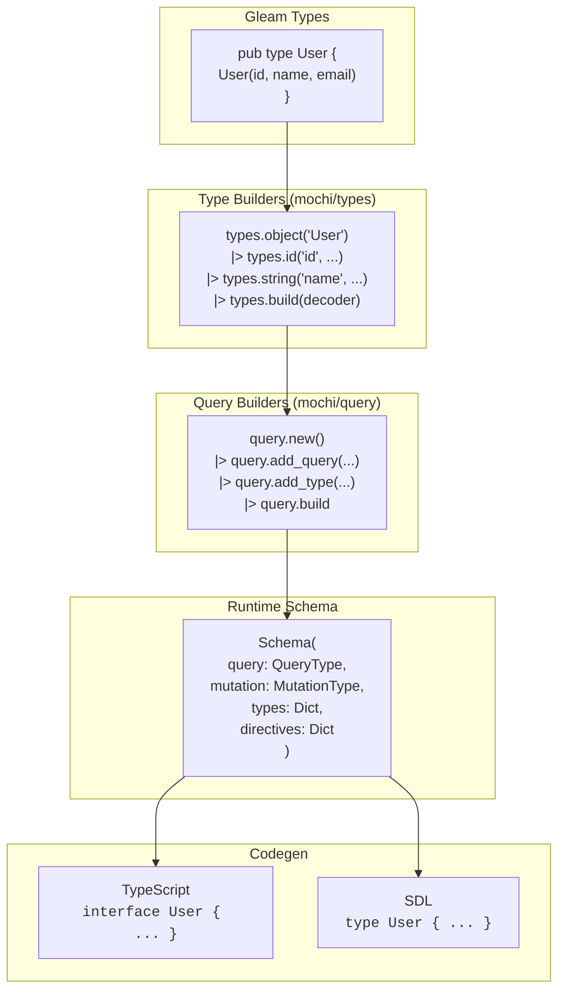
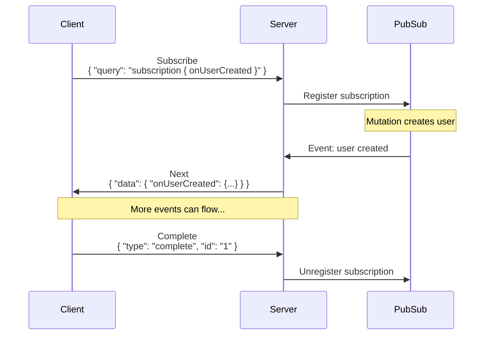
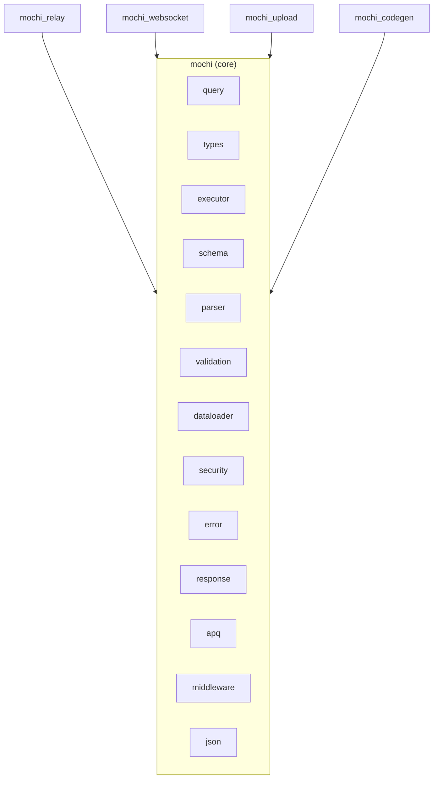
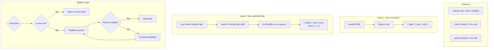

# Mochi Architecture

This document describes how Mochi processes GraphQL requests from receiving a query to returning a response.

## High-Level Flow


```mermaid
flowchart TD
    subgraph Client
        A[POST /graphql<br/>query + variables]
    end

    subgraph "1. HTTP Handler"
        B[Wisp / Mist / Custom]
        B --> B1[Parse JSON body]
        B1 --> B2[Extract query + variables]
    end

    subgraph "2. Parse Cache + Parser"
        C0[mochi/document_cache.gleam]
        C[mochi/parser.gleam]
        C1[Lexer] --> C2[Tokens] --> C3[Parser] --> C4[AST]
        C0 -->|cache hit| C4
        C0 -->|miss| C
    end

    subgraph "3. Validation"
        D[mochi/validation.gleam]
        D1{Valid?}
        D2[Continue]
        D3[Return Errors]
    end

    subgraph "4. Security"
        E[mochi/security.gleam]
        E1[Max Depth]
        E2[Complexity]
        E3[Max Aliases]
    end

    subgraph "5. Executor"
        F[mochi/executor.gleam]
        F1[ExecutionContext]
        F2[Field Resolution]
    end

    subgraph "6. Response"
        G[mochi/response.gleam]
        G1[JSON Response]
    end

    A --> B
    B2 --> C0
    C4 --> D
    D --> D1
    D1 -->|Yes| D2
    D1 -->|No| D3
    D2 --> E
    E --> F
    F1 --> F2
    F2 --> G
    G1 --> H[Client Response]
```

## Parser Pipeline


```mermaid
flowchart TD
    A["Query String<br/><code>{ user(id: 1) { name } }</code>"]

    subgraph Lexer
        B[Tokenize]
    end

    C["Tokens<br/><code>LBRACE, NAME, LPAREN, ...</code>"]

    subgraph Parser
        D[Recursive Descent]
    end

    subgraph AST
        E[Document]
        E1[OperationDefinition]
        E2[SelectionSet]
        E3["Field: user"]
        E4["Arguments: id=1"]
        E5[SelectionSet]
        E6["Field: name"]
    end

    A --> B --> C --> D
    D --> E
    E --> E1 --> E2 --> E3
    E3 --> E4
    E3 --> E5 --> E6
```

## Executor Field Resolution


```mermaid
flowchart TD
    Q[Query<br/>Root Type]

    Q --> users
    Q --> user
    Q --> posts

    subgraph "users resolver"
        users[users]
        users --> usersR["Resolver<br/>List&lt;User&gt;"]
    end

    subgraph "user resolver"
        user["user(id: 1)"]
        user --> userR["Resolver<br/>User"]
    end

    subgraph "posts resolver"
        posts[posts]
        posts --> postsR["Resolver<br/>List&lt;Post&gt;"]
    end

    userR --> name & email & age

    subgraph "Field Extractors"
        name["name<br/><code>fn(u) { u.name }</code>"]
        email["email<br/><code>fn(u) { u.email }</code>"]
        age["age<br/><code>fn(u) { u.age }</code>"]
    end
```

## DataLoader Batching

### Without DataLoader (N+1 Problem)


```mermaid
flowchart TD
    subgraph Query
        Q["{ posts { author { name } } }"]
    end

    subgraph Posts
        P1[Post 1] --> DB1[DB: user #1]
        P2[Post 2] --> DB2[DB: user #2]
        P3[Post 3] --> DB3[DB: user #1]
        P4[Post 4] --> DB4[DB: user #3]
        P5[Post 5] --> DB5[DB: user #2]
    end

    Q --> P1 & P2 & P3 & P4 & P5

    R[5 database queries!]
    DB1 & DB2 & DB3 & DB4 & DB5 -.-> R

    style R fill:#f66,color:#fff
```

### With DataLoader


```mermaid
flowchart TD
    subgraph Query
        Q["{ posts { author { name } } }"]
    end

    subgraph Posts
        P1[Post 1]
        P2[Post 2]
        P3[Post 3]
        P4[Post 4]
        P5[Post 5]
    end

    Q --> P1 & P2 & P3 & P4 & P5

    subgraph DataLoader
        DL1["Collect keys: [1, 2, 1, 3, 2]"]
        DL2["Dedupe: [1, 2, 3]"]
        DL1 --> DL2
    end

    P1 & P2 & P3 & P4 & P5 --> DL1

    DB["Single DB Query<br/>WHERE id IN (1, 2, 3)"]
    DL2 --> DB

    R[1 database query!]
    DB --> R

    style R fill:#6f6,color:#fff
```

## Schema Definition Flow


```mermaid
flowchart TD
    subgraph "Gleam Types"
        A["pub type User {<br/>  User(id, name, email)<br/>}"]
    end

    subgraph "Type Builders (mochi/types)"
        B["types.object('User')<br/>|> types.id('id', ...)<br/>|> types.string('name', ...)<br/>|> types.build(decoder)"]
    end

    subgraph "Query Builders (mochi/query)"
        C["query.new()<br/>|> query.add_query(...)<br/>|> query.add_type(...)<br/>|> query.build"]
    end

    subgraph "Runtime Schema"
        D["Schema(<br/>  query: QueryType,<br/>  mutation: MutationType,<br/>  types: Dict,<br/>  directives: Dict<br/>)"]
    end

    subgraph Codegen
        E1["TypeScript<br/><code>interface User { ... }</code>"]
        E2["SDL<br/><code>type User { ... }</code>"]
    end

    A --> B --> C --> D
    D --> E1
    D --> E2
```

## Subscription Flow


```mermaid
sequenceDiagram
    participant Client
    participant Server
    participant PubSub

    Client->>Server: Subscribe<br/>{ "query": "subscription { onUserCreated }" }
    Server->>PubSub: Register subscription

    Note over PubSub: Mutation creates user

    PubSub->>Server: Event: user created
    Server->>Client: Next<br/>{ "data": { "onUserCreated": {...} } }

    Note over Client,Server: More events can flow...

    Client->>Server: Complete<br/>{ "type": "complete", "id": "1" }
    Server->>PubSub: Unregister subscription
```

## Module Dependencies


```mermaid
flowchart TD
    subgraph mochi["mochi (core)"]
        query[query]
        types[types]
        executor[executor]
        schema[schema]
        parser[parser]
        validation[validation]
        dataloader[dataloader]
        security[security]
        error[error]
        response[response]
        apq[apq]
        middleware[middleware]
        json[json]
    end

    mochi_relay --> mochi
    mochi_websocket --> mochi
    mochi_upload --> mochi
    mochi_codegen --> mochi
```

## Null Propagation


```mermaid
flowchart TD
    subgraph Schema
        S1["user(id: ID!): User  # nullable"]
        S2["name: String!  # non-null"]
        S3["posts: [Post!]!  # non-null"]
    end

    subgraph "Case 1: User not found"
        C1A["user(id: 999)"]
        C1B["Returns null"]
        C1C["{ 'data': { 'user': null } }"]
        C1A --> C1B --> C1C
    end

    subgraph "Case 2: Non-null field fails"
        C2A["user.name resolver fails"]
        C2B["name is String! (non-null)"]
        C2C["Null bubbles up to parent"]
        C2D["{ 'data': { 'user': null },<br/>'errors': [...] }"]
        C2A --> C2B --> C2C --> C2D
    end

    subgraph "Bubble Logic"
        B1{Field fails}
        B2{Is non-null?}
        B3[Return null for field]
        B4[Bubble to parent]
        B5{Parent nullable?}
        B6[Stop here]
        B7[Continue bubbling]

        B1 --> B2
        B2 -->|No| B3
        B2 -->|Yes| B4
        B4 --> B5
        B5 -->|Yes| B6
        B5 -->|No| B7 --> B4
    end
```

## File Structure

```
mochi/                          # Core GraphQL engine
└── src/mochi/
    ├── query.gleam             # Query/Mutation/Subscription builders
    ├── types.gleam             # Type builders (object, enum, fields)
    ├── schema.gleam            # Core schema types, ExecutionContext
    ├── parser.gleam            # GraphQL query parser
    ├── executor.gleam          # Query execution engine
    ├── validation.gleam        # Query validation
    ├── document_cache.gleam    # ETS/Map-backed parse cache
    ├── batch.gleam             # Batch query execution
    ├── dataloader.gleam        # N+1 query prevention
    ├── error.gleam             # GraphQL-spec errors
    ├── response.gleam          # Response serialization
    ├── security.gleam          # Query depth/complexity limits
    ├── telemetry.gleam         # Execution hooks
    ├── middleware.gleam        # Request/response middleware pipeline
    ├── json.gleam              # JSON serialization
    └── apq.gleam               # Automatic Persisted Queries

mochi_relay/                    # Relay-style cursor pagination
└── src/mochi_relay/
    └── connections.gleam

mochi_websocket/                # graphql-ws protocol
└── src/mochi_websocket/
    ├── websocket.gleam
    └── subscription.gleam

mochi_upload/                   # GraphQL multipart uploads
└── src/mochi_upload/
    ├── upload.gleam
    └── multipart.gleam

mochi_codegen/                  # SDL + TypeScript + GraphiQL + CLI
└── src/mochi_codegen/
    ├── sdl.gleam
    ├── typescript.gleam
    ├── playground.gleam
    ├── cli.gleam
    ├── config.gleam
    ├── gleam.gleam
    └── schema_gen.gleam
```
